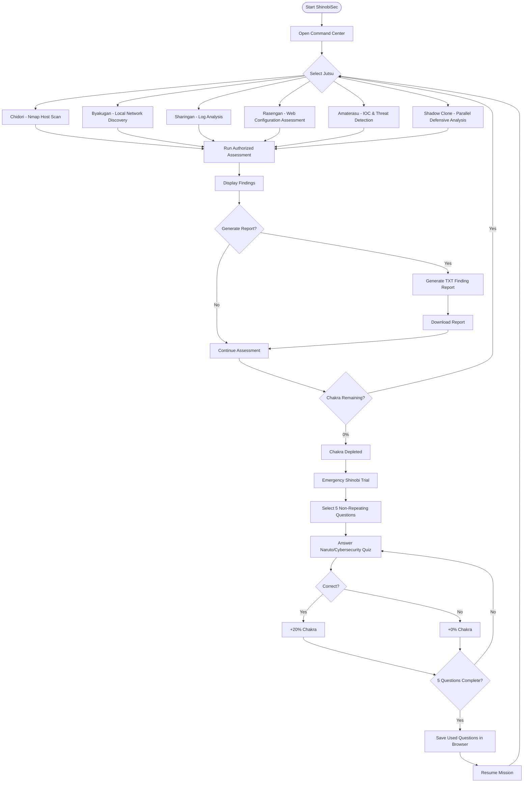

# ShinobiSec Working Flowchart

## Operational flow

1. Start the Flask application and open the ShinobiSec command center.
2. Select one of the six online Jutsu modules.
3. Provide module input and run the authorized assessment.
4. Review the findings displayed in the operation panel.
5. Generate and optionally download a text finding report.
6. Chakra is consumed by operations.
7. When chakra reaches 0%, the Emergency Shinobi Trial starts.
8. Five questions are selected while excluding previously used questions.
9. Correct answers restore 20% chakra; incorrect answers restore 0%.
10. Used-question IDs are stored in browser local storage until the question pool is exhausted.
11. After recovery, the user returns to the mission command center.

> Authorization: Run security assessment functions only against systems and networks you own or are explicitly authorized to test.
